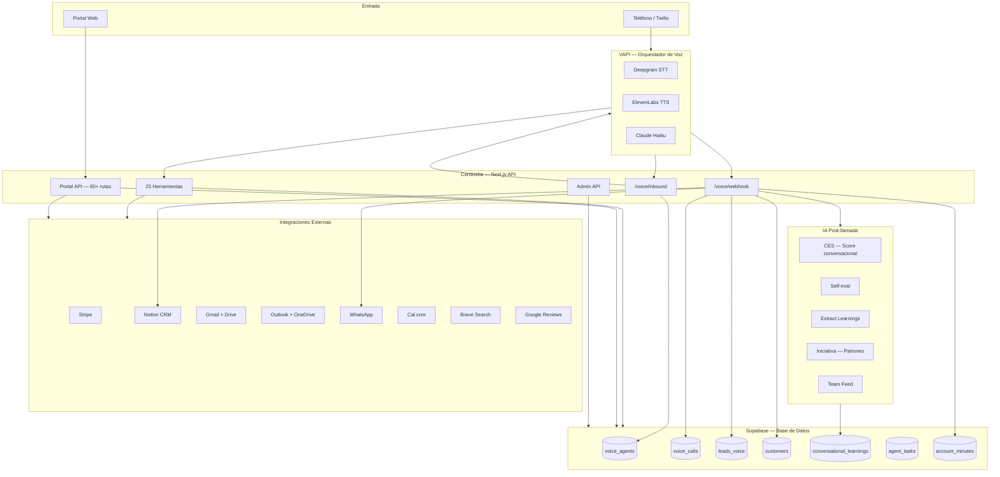
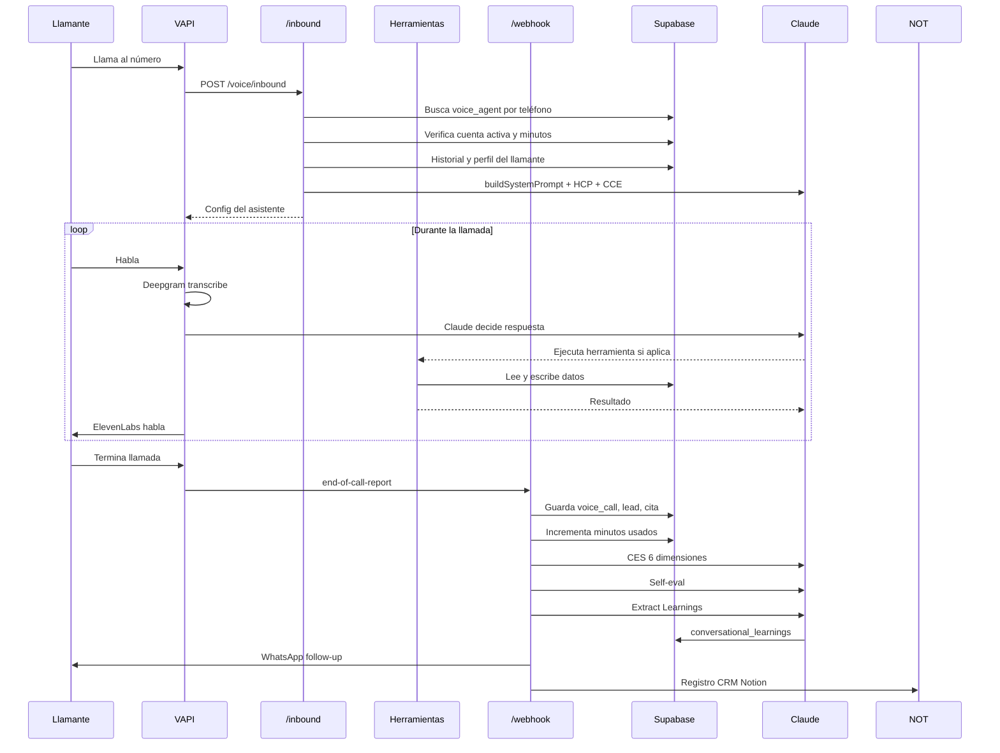
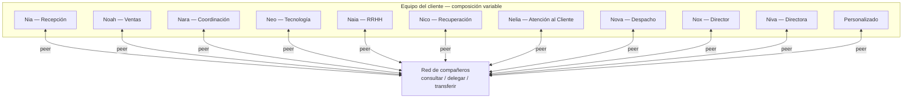
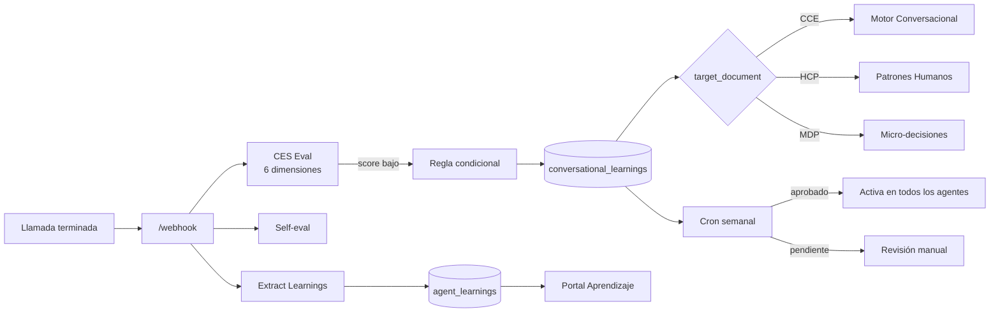

# Topología Centinelia

## 1. Sistema Completo

---

## 2. Flujo de Llamada

---

## 3. Empleados y Conexiones

> El equipo de cada cliente es distinto. La red entre compañeros se forma dinámicamente con los empleados activos de esa cuenta. Cualquier empleado puede consultar, delegar o transferir a cualquier compañero disponible.

**Reglas de la red:**
- Un cliente con solo 1 empleado no tiene peers — opera solo.
- Un cliente con 5 empleados sin directores puede delegar y consultar entre esos 5.
- Un cliente con 5 empleados personalizados tiene la misma red entre ellos.
- Los directores (Nox/Niva) no tienen privilegios especiales en el código — son peers como cualquier otro.

---

## 4. Pipeline de Aprendizaje

